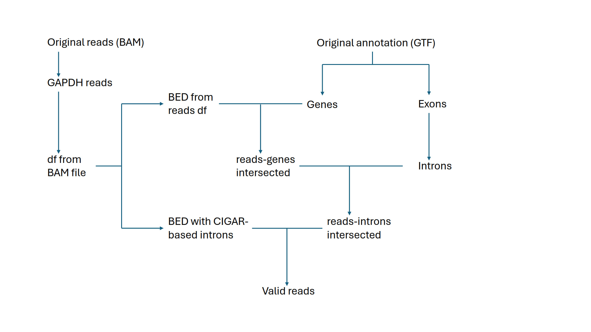

# scQPAS - Single-Cell Quantification of PolyAdenylation Sites

A Nextflow pipeline for detecting and quantifying polyadenylation sites from single-cell RNA-seq data.


## Project Status

**Current Stage:**

- The code is being migrated from standalone scripts into a modular, reproducible package
- Code for specific CPA site is developed

**To be implemented:**

- Proper environment.yml file (or .toml ?)
- Code for random amount of different CPA sites
- Potentially: Code for visualizations of distance graphs
- Code for Likelihood calculation
- Nextflow pipeline and unit tests


## Repository Structure

```
scQPAS/
├── README.md                   # This file
├── LICENSE                     # Apache 2.0 (chosen arbitrarly for now)
├── environment.yml             # Conda environment specification (to be implemented)
│
├── src/                        # Core library code (importable Python modules)
│   ├── __init__.py
│   ├── reads.py                # Extract reads, detect polyA tails, compute CPA sites
│   ├── annotation.py           # Parse GTF, extract genes/exons/introns to BED
│   ├── gtf_extend.py           # Extend terminal exons by 1kb
│   ├── cigar.py                # Parse CIGAR strings, validate introns
│   ├── distances.py            # Calculate distances from CPA site to read ends
│   ├── main.nf                 # Nextflow pipeline (single sample), should serve as entry point
│   └── nextflow.config         # Nextflow configuration
│
├── bin/                        # Wrapper scripts (called by Nextflow)
│   ├── extract_reads.py        # CLI wrapper for src.reads
│   ├── extract_annotation.py   # CLI wrapper for src.annotation
│   ├── extend_gtf.py           # CLI wrapper for src.gtf_extend
│   ├── filter_cigar.py         # CLI wrapper for src.cigar
│   └── calculate_distances.py  # CLI wrapper for src.distances
│
├── tests/                      # Unit tests (to be implemented)
│   ├── test_reads.py
│   ├── test_annotation.py
│   ├── test_cigar.py
│   ├── test_distances.py
│   └── test_gtf_extend.py
│
└── results/                    # Output directory (git-ignored)
```


## Pipeline Overview

The pipeline processes single-cell BAM files to quantify distances between reads cleavage and polyadenylation (CPA) sites:

1. **GTF Extension** (`gtf_extend.py`): Extend terminal exons by 1kb to capture 3' UTR extensions
2. **Read Extraction** (`reads.py`): Extract read information from BAM, detect polyA tails (by sequence composition), compute CPA sites
3. **Annotation Extraction** (`annotation.py`): Parse GTF to generate BED files for genes, exons, introns
4. **Intron Intersection** (bedtools): Intersect reads with annotated introns
5. **CIGAR Filtering** (`cigar.py`): Validate reads by comparing CIGAR-derived introns with annotation
6. **Distance Calculation** (`distances.py`): Compute distances from CPA sites to read ends, adjusting for intron lengths

### Data Flow



### Setup

**This is just a placeholder! To be filled correctly once applicable**

```bash
# Clone the repository
git clone https://github.com/sglnat/scQPAS.git
cd scQPAS

# Create conda environment
conda env create -f environment.yml

# Activate environment
conda activate scQPAS
```


## Development Notes

### Code Organization

- **`src/`**: Pure Python functions, no I/O or hardcoded paths. Fully importable and testable.
- **`bin/`**: Thin wrappers that handle argument parsing and call `src/` functions. These are what Nextflow executes.
- **`tests/`**: Unit tests for `src/` modules (to be implemented).

### Current Limitations (according to AI)

- No logging framework (uses print statements)
- No config file for parameters (all passed as CLI args)
- Nextflow files localization


## License

Apache License 2.0 - See [LICENSE](LICENSE) for details.